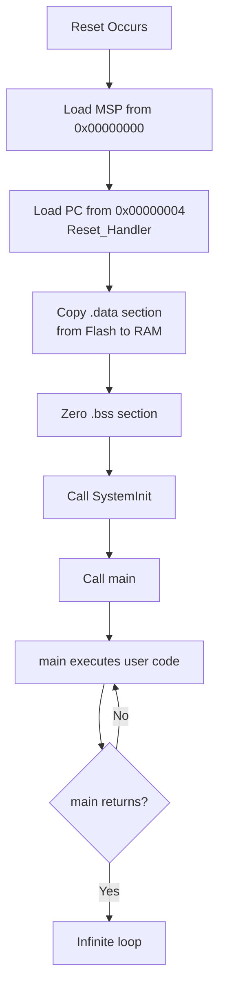

# 🧠 STM32 Startup Sequence — `startup.s` Explained

This document provides a detailed explanation of the **startup assembly file (`startup.s`)** used when booting bare-metal firmware (without OS) for Cortex-M microcontrollers such as STM32.  
It initializes memory, prepares the runtime environment, and transfers control to `main()`.

---

## ⚙️ Overview

When a microcontroller resets, execution begins at **address `0x00000000`**.  
Two 32-bit words are read from Flash:

| Address | Purpose | Description |
|----------|----------|-------------|
| `0x00000000` | **MSP (Main Stack Pointer)** | Initial value loaded into MSP — used for local variables, arguments, and return values. |
| `0x00000004` | **Reset_Handler address** | The first program executed after reset; loads into the PC (Program Counter). |

---

## 🧩 Memory Sections

### 1️⃣ `.isr_vector` — Interrupt Vector Table

This section defines the **Interrupt Vector Table**, which contains addresses of all exception and interrupt handlers.

| Entry | Description |
|--------|--------------|
| 0 | Initial **Main Stack Pointer (MSP)** value |
| 1 | Address of **Reset_Handler** |
| 2–15 | Core system exception handlers (NMI, HardFault, MemManage, BusFault, UsageFault, SVCall, DebugMon, PendSV, SysTick) |
| 16+ | Peripheral ISRs (Timer, UART, ADC, SPI, etc.) |

#### 🧾 Example Implementation
```asm
.section .isr_vector
.global g_pfnVectors
g_pfnVectors:
    .word _estack            /* Top of Stack */
    .word Reset_Handler      /* Reset Handler */
    .word NMI_Handler        /* NMI Handler */
    .word HardFault_Handler  /* Hard Fault Handler */
    .word MemManage_Handler  /* MPU Fault Handler */
    .word BusFault_Handler   /* Bus Fault Handler */
    .word UsageFault_Handler /* Usage Fault Handler */
    .word 0                  /* Reserved */
    /* ... Other system handlers ... */
    .word SVC_Handler        /* SVCall Handler */
    .word DebugMon_Handler   /* Debug Monitor Handler */
    .word 0                  /* Reserved */
    .word PendSV_Handler     /* PendSV Handler */
    .word SysTick_Handler    /* SysTick Handler */
    /* ... Peripheral interrupt handlers ... */
    .word WWDG_IRQHandler    /* Window Watchdog */
    .word PVD_IRQHandler     /* PVD through EXTI Line detect */
```

---

### 2️⃣ `Reset_Handler` — Startup Routine

The **Reset Handler** is the first C/assembly code executed after reset.  
Its primary purpose is to prepare the **runtime environment** so that C/C++ programs can run correctly.

#### Key Responsibilities:
1. **Copy initialized data (`.data`) from Flash → RAM**
2. **Zero-initialize uninitialized data (`.bss`)**
3. **Call `SystemInit()`**
4. **Call `main()`**

#### 🧾 Example Implementation
```asm
.section .text.Reset_Handler
.thumb
.thumb_func
Reset_Handler:
    /* Step 1: Copy .data from Flash to RAM */
    ldr r1, =__etext        /* Source: LMA of .data (in Flash) */
    ldr r2, =__data_start__ /* Destination: start of .data (in RAM) */
    ldr r3, =__data_end__   /* End of .data section */

copy_data_loop:
    cmp r2, r3
    bhs copy_data_done
    ldr r0, [r1], #4
    str r0, [r2], #4
    b copy_data_loop
copy_data_done:

    /* Step 2: Zero out .bss */
    ldr r1, =__bss_start__
    ldr r2, =__bss_end__
    movs r0, #0

zero_bss_loop:
    cmp r1, r2
    bhs zero_bss_done
    str r0, [r1], #4
    b zero_bss_loop
zero_bss_done:

    /* Step 3: Call SystemInit() and main() */
    bl SystemInit
    bl main

    /* Step 4: Infinite loop if main() returns */
loop_forever:
    b loop_forever
```

---

## 🧱 Runtime Initialization Details

### 🧮 `.data` Section
- Holds global/static variables **with** initial values.
- Values are **stored in Flash** (ROM) but must be **copied to RAM** during startup.

### 🪣 `.bss` Section
- Holds global/static variables **without** explicit initialization.
- Must be **zero-cleared** before `main()` starts.

### ⚙️ `SystemInit()`
Defined in CMSIS (Cortex Microcontroller Software Interface Standard).  
Executed before `main()` to configure low-level hardware:

- Initialize **clock system** (PLL, HSI/HSE, SYSCLK)
- Enable **FPU (Floating-Point Unit)** if available
- Re-map **vector table** from Flash to RAM (optional)

---

## 🧭 Startup Sequence Summary



---

## 🧰 Developer Notes

- `startup.s` is **architecture-specific** (Cortex-M0/M3/M4/M7 differ slightly).
- `SystemInit()` is provided in the **device HAL / CMSIS** package.
- `_estack`, `__etext`, `__data_start__`, etc., are symbols **defined in the linker script (`.ld`)**.
- Without proper linker script definitions, this startup code **won’t link successfully**.

---

## 📚 References

- **ARM® Cortex-M Technical Reference Manual**  
- **CMSIS (Cortex Microcontroller Software Interface Standard)**  
- **STM32 Reference Manual & HAL documentation**